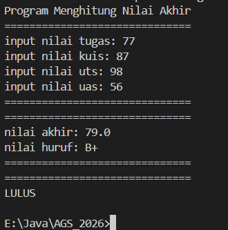
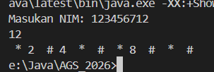
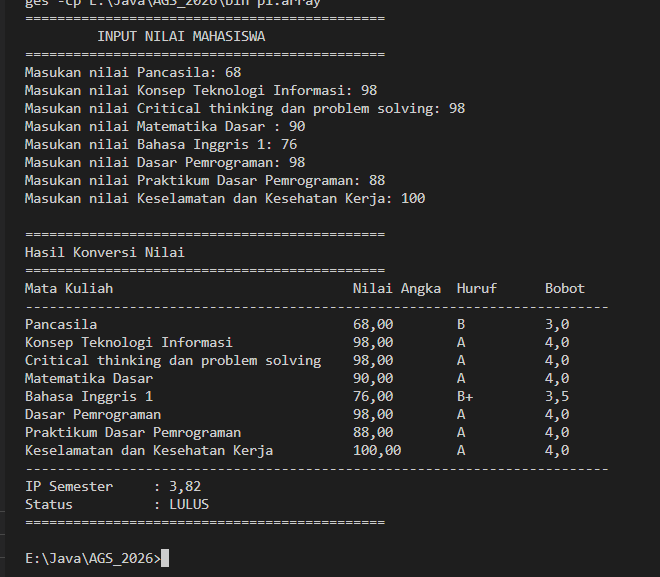
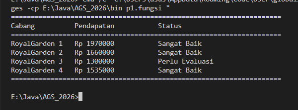
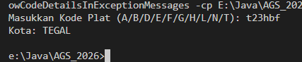
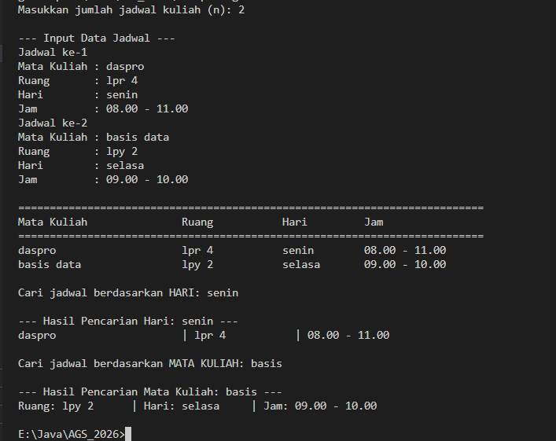

|  | Algorithm and Data Structure |
|--|--|
| NIM |  254107020022|
| Nama |  Jovita Maharani |
| Kelas | TI - 1F |
| Repository | [link] (https://github.com/jovitamaharani/AGS_2026/tree/main/src/p1) |

# Jobsheet 1 #1 KONSEP DASAR PEMROGRAMAN

## 2.2.1 Praktikum Pemilihan

## 2.3.1 Praktikum Perulangan

## 2.4.1 Praktikum Array

## 2.5.1 Praktikum Fungsi

## Tugas 1

## Tugas 2
