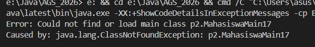
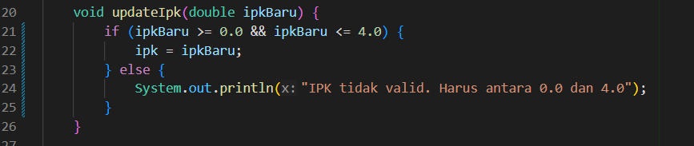
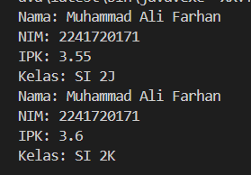

|  | Algorithm and Data Structure |
|--|--|
| NIM |  254107020022|
| Nama |  Jovita Maharani |
| Kelas | TI - 1F |
| Repository | [link] (https://github.com/jovitamaharani/AGS_2026/tree/main/src/p2) |

# Jobsheet 2 #2 ALGORITMA DAN STRUKTUR DATA

## 2.1 Percobaan 1: Deklarasi Class, Atribut dan Method

Pertanyaan: 
1. Sebutkan dua karakteristik class atau object!
    - Object = memiliki atribut, memiliki method
    - Class = masih berupa rancangan, tidak memiliki nilai atribut
2. Perhatikan class Mahasiswa pada Praktikum 1 tersebut, ada berapa atribut yang dimiliki oleh class Mahasiswa? Sebutkan apa saja atributnya!
    - Ada 4 atribut, yaitu nama, nim, kelas, dan ipk.
3. Ada berapa method yang dimiliki oleh class tersebut? Sebutkan apa saja methodnya! Perhatikan method updateIpk() yang terdapat di dalam class Mahasiswa. Modifikasi isi method tersebut sehingga IPK yang dimasukkan valid yaitu terlebih dahulu dilakukan pengecekan apakah IPK yang dimasukkan di dalam rentang 0.0 sampai dengan 4.0 (0.0 <= IPK <= 4.0). Jika IPK tidak pada rentang tersebut maka dikeluarkan pesan: "IPK tidak valid. Harus antara 0.0 dan 4.0".
    -
4. Perhatikan method updateIpk() yang terdapat di dalam class Mahasiswa. Modifikasi isi method tersebut sehingga IPK yang dimasukkan valid yaitu terlebih dahulu dilakukan pengecekan apakah IPK yang dimasukkan di dalam rentang 0.0 sampai dengan 4.0 (0.0 <= IPK <= 4.0). Jika IPK tidak pada rentang tersebut maka dikeluarkan pesan: "IPK tidak valid. Harus antara 0.0 dan 4.0".
    
5. Jelaskan bagaimana cara kerja method nilaiKinerja() dalam mengevaluasi kinerja mahasiswa, kriteria apa saja yang digunakan untuk menentukan nilai kinerja tersebut, dan apa yang dikembalikan (di-return-kan) oleh method nilaiKinerja() tersebut?
    - method nilaiKinerja() Mengevaluasi nilai atribut ipk menggunakan struktur if-else. Kriteria: ≥ 3.5 (sangat baik), ≥ 3.0 (baik), ≥ 2.0 (cukup), di bawah itu (kurang). Method me-return data tipe String

## 2.2 Percobaan 2: Instansiasi Object, serta Mengakses Atribut dan Method

Pertanyaan:
1. Pada class MahasiswaMain, tunjukkan baris kode program yang digunakan untuk proses
instansiasi! Apa nama object yang dihasilkan?
    - Baris instansiasi: Mahasiswa mhs1 = new Mahasiswa();. Nama object adalah mhs1
2. Bagaimana cara mengakses atribut dan method dari suatu objek?
    - Menggunakan operator titik (.) setelah nama objek contoh: mhs1.nama
3. Mengapa hasil output pemanggilan method tampilkanInformasi() pertama dan kedua berbeda?
    - Karena ada pemanggilan method ubahKelas() dan updateIpk() yang mengubah nilai atribut pada objek tersebut sebelum pemanggilan kedua

